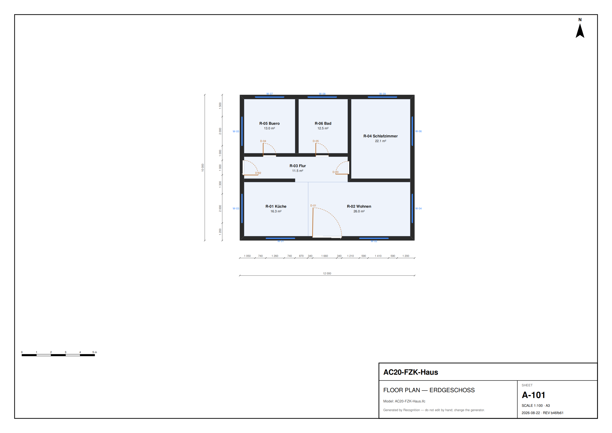

# Recognition

**Your AI architect.** Tell it what you want to build — an office for your
startup, a 3BHK for your family, a weekend house, a small warehouse — the way
you'd tell a person. It asks only what it genuinely needs, drafts **four
structurally different blueprints** with dimensions, redrafts as you talk, and
builds the **3D model** of the one you pick. Building regulations run
underneath as the quality gate: every layout is verified against a cited
ruleset before you ever see it, and the checks are one quiet tap away.

**Devin** is the intelligence — it reads the conversation, plans layouts, and
reviews winners; deterministic code draws every line and judges every rule.
No human sits between a sealed brief and the finished artifacts.



*Generated by the pipeline — no hand edits.*

---

## Why architecture has a loop

Software improves fast because every attempt gets a verdict: write, run, test, fix.
Most industries have the same engineering problems and no such loop — work goes out,
and someone finds out months later whether it was right.

Architecture is an exception hiding in plain sight. **Building code is
machine-checkable.** Clear heights, daylight ratios, door widths, corridor
clearances, which rooms a dwelling must contain — all of it is decidable from a
model. The verdict already exists. Nothing was sitting inside the loop.

Recognition is the layer that puts an agent inside it.

```
brief ──▶ N strategies ──▶ build each ──▶ verify each ──▶ merge the winner
             (Devin)        (0 tokens)     (the gate)       (no human)
```

## The thesis

> **The model plans. The code draws.**

Devin never emits a coordinate and never states a regulation. It returns an
`ArchitectPlan` — rooms, areas, adjacencies — and deterministic code turns that into
geometry. A separate deterministic engine judges the result against a cited ruleset.

That split is the whole design. A language model cannot report its own success here,
because the artifacts it is judged on are produced downstream by code it never ran.

## Try it

**In the browser — [recognition, live](https://0-uddeshya-0.github.io/Recognition/):**

1. **Say it.** "An office for my small startup — 8 of us, an open studio, a
   meeting room, a small kitchen." The agent understands buildings, not forms;
   switch it to *Devin · live* for the session that genuinely reads.
2. **Choose.** Four takes arrive as dimensioned blueprints — compact, linear,
   open, generous. Tap a sheet to inspect it; keep talking to redraft.
3. **Build.** Pick one and the 3D model appears; archive it and the pipeline
   re-verifies, merges itself, and the design joins the portfolio with files
   a builder opens (IFC, DXF, PDF).

Nothing to install, nothing to sign in to, no key in the URL. **The page holds
no secret at all:** a tiny Cloudflare relay ([`infra/trigger-worker.js`](infra/trigger-worker.js))
keeps the GitHub token server-side and answers exactly two things — start one
allow-listed workflow, and read back the handful of run/artifact endpoints the
page needs. Everything you watch on screen is a real GitHub Actions run.

Locally:

```bash
uv sync
uv run recognition autopilot briefs/familienhaus.json          # ~20 s, no API key, no cost
uv run recognition autopilot briefs/familienhaus.json --engine devin
uv run pytest -q
```

The first command takes one brief, explores four structurally different layouts,
builds and verifies each, and picks a winner — with nobody choosing.

```
autopilot · Familienhaus · engine=local · 4 candidates
  · compact   PASS — 57 checked · 2 not evaluated · 0 failed
  · linear    PASS — 57 checked · 2 not evaluated · 0 failed
  · open      PASS — 54 checked · 2 not evaluated · 0 failed
  · generous  PASS — 57 checked · 2 not evaluated · 0 failed

  winner: open — chosen by the scorer, not a human
```

## What comes out

Per candidate, in `out/autopilot/<project>/<strategy>/`:

| Artifact | What it is |
|---|---|
| `model.ifc` | IFC4 with real `IfcSpace` / `IfcWall` / `IfcDoor` and proper openings — opens in Revit or ArchiCAD |
| `sheets/*.svg .pdf .png .dxf` | Dimensioned floor plans with a title block. DXF goes straight into AutoCAD |
| `mesh.json` | Triangulated geometry for the web viewer |
| `schedules/*.csv .md` | Room, door and window schedules |
| `verdict.json` | Every finding with its tier, message and statute citation |
| `design.py` | The building as readable code — the reviewable source of truth |
| `plan.json` | The plan the agent actually returned |

## How it works

Nine layers, each reading only what the one below produced.
Full detail in [`docs/architecture/`](docs/architecture/README.md).

| | Layer | Model? |
|---|---|---|
| **L0** | Jurisdiction pack — rules as data, with citations | no |
| **L1** | Brief — intent captured *before* the trigger | cheap |
| **L2** | Architect — areas and adjacencies, **no coordinates** | strongest |
| **L3** | Translator — plan → `design.py` at **zero tokens** | **none** |
| **L4** | Geometry — IFC4, sheets, mesh, schedules | no |
| **L5** | Verifier — the only gate | no |
| **L6** | Iteration — routes a change to the lowest layer that can satisfy it | router |
| **L7** | Studio — conversation, blueprints, 3D, findings in the browser | no |
| **L8** | Orchestration — GitHub Actions, the trigger relay, Devin, provenance | no |

Three workflows carry the product: **`draft`** (a merge-free round of four
takes, returned as one bundle), **`interview`** (one live Devin turn), and
**`autopilot`** (the full run that verifies, merges itself on green, and
publishes to the portfolio).

### The five sources of truth

Everything else is derived and may be deleted and regenerated. **Nothing derived is
ever hand-edited** — not by a person, not by an agent.

| Authority over | Artifact |
|---|---|
| Intent | `briefs/<project>.json` |
| Regulation | `rules/by/*.yaml` — no LLM may author or edit a rule |
| Geometry | `design/<project>.py` — readable, diffable, reviewable in 30 seconds |
| Exchange | `out/**/model.ifc` — pure output |
| Provenance | git history + Entire checkpoints |

## Compliance you can audit

Every rule carries a `tier` and a citation, and **loading fails without them**.

| Tier | Means | Can block a merge? |
|---|---|---|
| `law` | a cited statute article — BayBO Art. 45 (1) | **yes** |
| `standard` | a DIN norm, binding once triggered | only when triggered |
| `guidance` | published *Richtwerte* | **never** |
| `house` | this practice's own convention | **never** |

Two things this catches that a flat severity list cannot:

- **`ROOM-MIN-AREA` is guidance, not law.** BayBO sets no minimum bedroom area — 9 m²
  is a *Richtwert*. It warns; it never blocks.
- **Blind spots are declared.** Smoke detectors and thresholds cannot be checked from a
  model, so they report **NOT EVALUATED** and are never counted as passes. The stamp
  always carries coverage: `57 checked · 2 not evaluated · 0 failed`. **No run ever
  shows a bare PASS.**

Regulations covered in v1 (Bayern, residential): BayBO
[Art. 45](https://www.gesetze-bayern.de/Content/Document/BayBO-45) ·
[Art. 46](https://www.gesetze-bayern.de/Content/Document/BayBO-46) ·
[Art. 48](https://www.gesetze-bayern.de/Content/Document/BayBO-48) ·
[DIN 18040-2](https://nullbarriere.de/din18040-2-tueren.htm).

> This is a design aid, not legal advice, and no substitute for a *Prüfstatiker* or a
> submitting architect. Nothing here is certified.

## Autonomy

The human is at the **trigger**, never inside the run. There is no approve step: the
verifier is the only gate, and a green run merges itself. Details and reasoning in
[`docs/architecture/autonomy.md`](docs/architecture/autonomy.md).

A brief with more than two dwellings **auto-triggers BayBO Art. 48** — DIN 18040-2
becomes mandatory and the same corridor finding flips from advisory to blocking.
Nobody configured that; the rule declares its own trigger, and the interview asks
about dwelling count *because* the rule says it needs it.

```bash
uv run recognition autopilot briefs/dreifamilienhaus.json   # watch the tier flip
```

## Triggering it

```bash
# locally
uv run recognition autopilot briefs/<name>.json

# from anywhere — the browser holds no secret
gh api repos/0-uddeshya-0/Recognition/dispatches \
  -f event_type=design-request \
  -F client_payload[brief]=briefs/familienhaus.json

# or just commit a brief to briefs/ — that is itself a trigger
```

## Layout

```
recognition/
  contracts.py    DesignBrief / ArchitectPlan — validated at every boundary
  interview.py    L1 — prose in, sealed brief out, via a relayed Devin session
  translate.py    plan → design DSL, deterministic, zero model tokens
  design.py       the DSL → IFC4 via ifcopenshell
  drawings.py     IFC → dimensioned SVG / PDF / PNG / DXF sheets
  rules.py        rule predicates
  score.py        provenance tiers, the verdict, and the ranking
  devin.py        Devin v1 client and parallel fan-out
  bundle.py       one drafting round → a single JSON the Studio renders
  autopilot.py    the loop
.agents/skills/   repo skills any agent discovers (@skills:architect-plan …)
playbooks/        Devin playbooks (interview, detailing, rule changes)
rules/by/         jurisdiction packs — data, with citations
briefs/           the triggers
web/              the Studio — index.html · glass.css · app.js · config.js
infra/            the trigger relay (Cloudflare Worker) + its deploy script
.github/workflows/  draft · interview · autopilot · pages
docs/architecture/  how and why
```

## Docs

- [The pitch](docs/pitch.md) — problem · approach · solution, and every judging criterion mapped to a live run
- [Architecture](docs/architecture/README.md) — the nine layers in full
- [Autonomy](docs/architecture/autonomy.md) — where the human is, and is not
- [Contracts](docs/architecture/contracts.md) — the typed handoffs
- [Regulations](docs/architecture/regulations.md) — tiers, the Bayern pack, blind spots
- [Decisions](docs/architecture/adr/) — the four that are expensive to reverse
- [AGENTS.md](AGENTS.md) — how an agent works in this repo

## Development

```bash
uv sync
uv run pytest -q
```

On macOS, `cairosvg` needs the native cairo library on the dyld path:

```bash
brew install cairo
export DYLD_FALLBACK_LIBRARY_PATH=/opt/homebrew/lib:$DYLD_FALLBACK_LIBRARY_PATH
```
